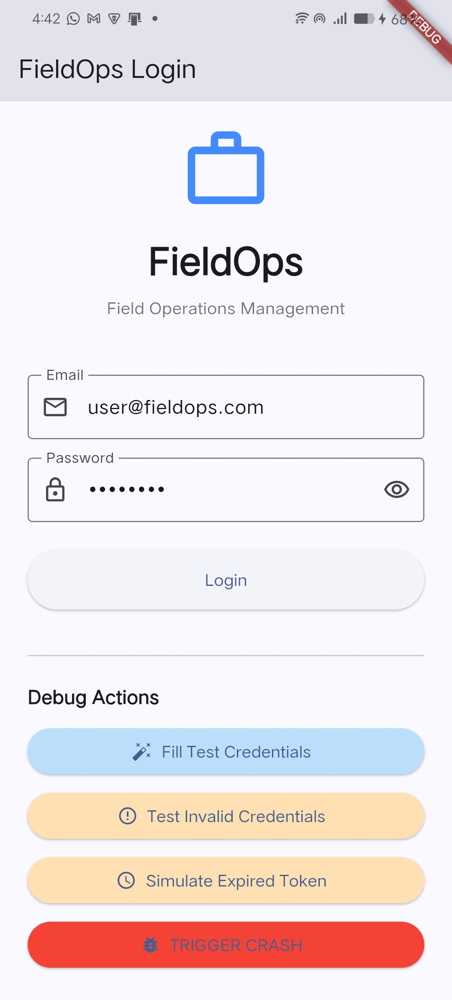
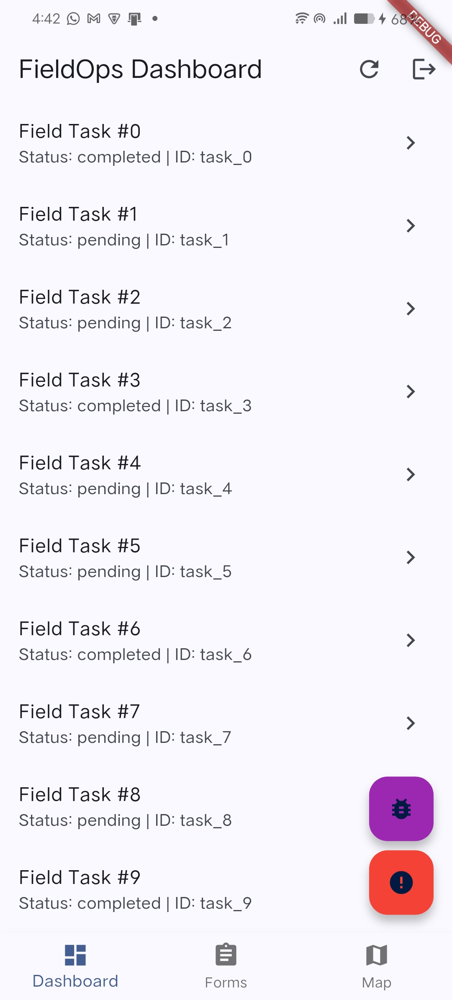
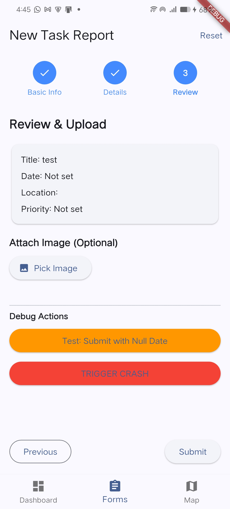

# FieldOps - Complete Sentry Flutter Demo App

FieldOps is a production-style Flutter application designed to demonstrate **all major Sentry Flutter capabilities** using only free and open-source tools.

## 📸 Screenshots






## 🏗 Architecture

- **Clean Architecture**: Separated into Data, Domain, Presentation, and Core layers
- **State Management**: Riverpod (MVVM pattern)
- **Navigation**: GoRouter with Sentry Navigation Observer
- **Dependency Injection**: Manual DI with Riverpod providers
- **Null-Safe**: Full null safety throughout
- **Sentry**: Fully integrated for Errors, Performance, Context, and Release Health

## 🚀 Features & Sentry Integration

### 1. Authentication Module

**Features:**

- Complete login form with email/password validation
- Token persistence using Hive local storage
- Auto-login on app restart
- Expired token handling

**Sentry Integration:**

- User context (ID, email, role) set on login
- Breadcrumbs for all user actions (login attempts, form interactions)
- Error tracking for invalid credentials, 500 errors, expired tokens
- Tags for filtering by auth status and error type

**Crash Scenarios:**

- Invalid credentials (401) - Handled error with breadcrumbs
- Server error (500) - Captured as issue
- Expired token - Simulated 401 with context
- Intentional crash button - Unhandled exception

### 2. Dashboard (API Heavy Screen)

**Features:**

- Infinite scroll pagination
- Pull-to-refresh
- Loading, error, and empty states
- Performance monitoring

**Sentry Integration:**

- Performance transactions for API calls (`get_tasks_transaction`)
- Screen load performance tracking
- Custom spans for fetch operations
- Error tracking for network timeouts, malformed JSON, empty responses
- Breadcrumbs for pagination, refresh, and navigation

**Crash Scenarios:**

- Random 500 errors (10% chance) - Handled with context
- Malformed JSON (5% chance) - FormatException captured
- Network timeout (5% chance) - Exception with network context
- Empty response (5% chance) - Logged as breadcrumb
- Null pointer exception (FAB button) - Unhandled crash

### 3. Forms & Uploads

**Features:**

- Multi-step form (3 steps: Basic Info → Details → Review)
- Image picker integration
- Date picker with validation
- File upload simulation with progress
- Comprehensive validation (null values, invalid formats)

**Sentry Integration:**

- Breadcrumbs for each form step
- Validation error tracking
- Upload performance spans
- Upload failure capture with context
- Form submission transaction

**Crash Scenarios:**

- Null date validation - Error captured
- Invalid date format - Validation error logged
- Upload failure (20% chance) - Exception with file context
- Form submission with missing data - Validation error

### 4. Maps & Location

**Features:**

- Google Maps integration
- Current location tracking
- Real-time location updates
- Route drawing between points
- Permission handling (all states)

**Sentry Integration:**

- Permission request/denial breadcrumbs
- Location update tracking
- Map controller error handling
- Location null scenario tracking

**Crash Scenarios:**

- Permission denied - Warning breadcrumb
- Permission permanently denied - Error captured
- Location null/unavailable - Exception with context
- Map controller misuse - Error captured

### 5. Offline Mode

**Features:**

- Local cache using Hive
- Queue actions when offline
- Auto-sync on reconnect
- Duplicate detection
- Retry logic with max attempts

**Sentry Integration:**

- Sync process tracked as transaction
- Queue size tracking (tags)
- Sync failure capture
- Duplicate action detection (breadcrumbs)
- App kill during sync simulation

**Crash Scenarios:**

- Sync failure - Error with queue context
- Duplicate records - Warning breadcrumb
- App kill during sync - Exception logged

### 6. Background Tasks

**Features:**

- Background location tracking service
- Background sync service
- Background isolate crash simulation
- App killed state handling

**Sentry Integration:**

- Background task execution tracking
- Isolate error handling
- Background crash capture
- Task registration breadcrumbs

**Crash Scenarios:**

- Background isolate crash - Error captured with isolate context
- Battery optimization issues - Logged as warning

### 7. Network Connectivity Monitoring

**Features:**

- Connectivity stream monitoring
- Auto-sync trigger on connection restore
- Network state breadcrumbs
- Offline/online UI indicators

**Sentry Integration:**

- Network state change breadcrumbs
- Connection restore events logged
- Network status tags for filtering

## 🛠 Setup & Installation

### Prerequisites

- Flutter SDK (stable channel)
- Dart SDK (3.10.4+)
- Android Studio / Xcode (for mobile development)
- Sentry account (free tier works)

### Installation Steps

1. **Clone the repository:**

   ```bash
   git clone <repository-url>
   cd sentry_app
   ```

2. **Install dependencies:**

   ```bash
   flutter pub get
   ```

3. **Configure Sentry:**
   - Create a `.env` file in the root directory (copy from `.env.example`)
   - Get your Sentry DSN from [sentry.io](https://sentry.io)
   - Add your DSN to `.env`:

     ```
     SENTRY_DSN=https://your-dsn@sentry.io/project-id
     ```

4. **Configure Google Maps (Optional):**
   - Get a Google Maps API key from [Google Cloud Console](https://console.cloud.google.com)
   - Add to `android/app/src/main/AndroidManifest.xml`:

     ```xml
     <meta-data
         android:name="com.google.android.geo.API_KEY"
         android:value="YOUR_API_KEY"/>
     ```

   - Add to `ios/Runner/AppDelegate.swift` (if needed)

5. **Run the app:**

   ```bash
   flutter run
   ```

## 💥 Intentional Crash Scenarios

All crash scenarios are accessible from the **Crash Test Center** screen (accessible via dashboard FAB or `/crash-test` route).

| Scenario | Location | Error Type | Sentry Feature |
|----------|----------|------------|----------------|
| **Null Pointer** | Crash Test Center / Dashboard FAB | `NullPointerException` | Unhandled Error |
| **JSON Parsing** | Crash Test Center | `FormatException` | Handled Error |
| **UI Thread Freeze** | Crash Test Center | Infinite Loop | Error with context |
| **Background Isolate Crash** | Crash Test Center | `Exception` in isolate | Isolate Error Handler |
| **Permission Exception** | Crash Test Center / Map Screen | `PermissionException` | Handled Error |
| **Expired Token** | Crash Test Center / Login Screen | `Exception` (401) | Handled Error with context |
| **Network Timeout** | Crash Test Center | `TimeoutException` | Handled Error |
| **Background Task Crash** | Crash Test Center | Background isolate crash | Background Error Tracking |
| **Generic Exception** | Crash Test Center | `Exception` | Unhandled Error |
| **Login Exception** | Login Screen | `Exception` | Unhandled Error |
| **Map Controller Error** | Map Screen | `Exception` | Handled Error |
| **Upload Failure** | Forms Screen | `Exception` | Handled Error |
| **Invalid Credentials** | Login Screen | API 401 | Handled Error + Breadcrumbs |
| **Server Error** | Login/Dashboard | API 500 | Handled Error + Context |

## 📊 Monitoring in Sentry

### 1. Issues Dashboard

View all errors and exceptions:

- **Stack traces** with source code context
- **Device information** (OS, model, version)
- **User context** (ID, email, role)
- **Breadcrumbs** showing user actions before error
- **Tags** for filtering (environment, feature, error type)
- **Custom extra data** for debugging

### 2. Performance Monitoring

Track app performance:

- **App startup time** (`app_startup` transaction)
- **Screen load times** (each screen has its own transaction)
- **API latency** (`get_tasks_transaction`, `offline_sync`)
- **Custom spans** for critical operations
- **File upload performance** (form screen)

### 3. Release Health

Monitor release quality:

- **Crash-free session rate**
- **Error rate per release**
- **User impact** (affected users count)
- **Trends** over time

### 4. Breadcrumbs

See user journey before errors:

- **Navigation events** (screen changes)
- **User actions** (button clicks, form submissions)
- **API calls** (requests and responses)
- **Network state changes** (online/offline)
- **System events** (permissions, location updates)

## 🧠 Sentry Features Demonstrated

### ✅ Error Tracking

- **Handled exceptions** - Using `SentryConfig.captureException()`
- **Unhandled exceptions** - Global error handlers
- **Flutter framework errors** - `FlutterError.onError`
- **Async errors** - `PlatformDispatcher.onError`
- **Isolate errors** - Isolate error listeners

### ✅ Context & Metadata

- **User context** - ID, email, role
- **Tags** - Feature, module, error type, network status
- **Custom extra data** - Request payloads, user preferences
- **Environment** - Dev/Prod separation
- **Release** - Version tracking

### ✅ Breadcrumbs

- **API calls** - Request/response logging
- **Navigation events** - Screen transitions
- **Network state** - Connectivity changes
- **User actions** - Button clicks, form interactions
- **System events** - Permissions, location updates

### ✅ Performance Monitoring

- **App startup** - Cold start time tracking
- **Screen load** - Each screen performance
- **API latency** - Request/response times
- **Custom spans** - Critical operations
- **Transactions** - End-to-end operation tracking

### ✅ Release & Environment

- **Version tagging** - Release tracking
- **Environment separation** - Dev/Prod
- **Release health** - Crash-free rates

## 📁 Project Structure

```
lib/
├── bootstrap.dart           # App initialization logic
├── main.dart                # Entry point
├── core/
│   ├── errors/
│   │   ├── failure.dart              # Failure types
│   │   └── global_error_handler.dart # Global error handlers
│   ├── network/
│   │   └── connectivity_monitor.dart # Network monitoring
│   ├── offline/
│   │   └── offline_queue.dart       # Offline queue service
│   ├── background/
│   │   ├── background_service.dart   # Background task manager
│   │   ├── background_location_tracker.dart
│   │   └── background_sync_service.dart
│   ├── router/
│   │   └── app_router.dart          # Navigation with Sentry observer
│   └── sentry/
│       └── sentry_config.dart       # Sentry configuration & helpers
├── data/
│   ├── datasources/
│   │   ├── fake_auth_api.dart       # Mock auth API
│   │   ├── fake_dashboard_api.dart   # Mock dashboard API
│   │   └── local_storage.dart       # Hive-based storage
│   ├── models/
│   │   ├── task_model.dart
│   │   └── user_model.dart
│   └── repositories/
│       ├── auth_repository_impl.dart
│       └── dashboard_repository_impl.dart
├── domain/
│   ├── entities/
│   │   ├── task.dart
│   │   └── user.dart
│   └── repositories/
│       ├── auth_repository.dart
│       └── dashboard_repository.dart
└── presentation/
    ├── auth/
    │   ├── login_screen.dart
    │   └── login_controller.dart
    ├── dashboard/
    │   ├── dashboard_screen.dart
    │   └── dashboard_controller.dart
    ├── forms/
    │   └── form_screen.dart
    ├── maps/
    │   └── map_screen.dart
    ├── debug/
    │   └── crash_test_screen.dart   # Centralized crash testing
    ├── main_screen.dart
    └── providers.dart
```

## 🔍 Key Files Explained

### `lib/core/sentry/sentry_config.dart`

Central Sentry configuration and helper methods:

- `init()` - Initialize Sentry
- `captureException()` - Capture errors
- `setUserContext()` - Set user info
- `addBreadcrumb()` - Add breadcrumbs
- `startScreenTransaction()` - Track screen performance
- `setTag()` / `setExtra()` - Add metadata

### `lib/core/errors/global_error_handler.dart`

Global error handlers for:

- Flutter framework errors
- Async errors
- Isolate errors

### `lib/core/network/connectivity_monitor.dart`

Monitors network state and triggers auto-sync.

### `lib/core/offline/offline_queue.dart`

Offline queue with auto-sync on connection restore.

## 🎯 Learning Focus

Each file includes comments explaining:

- **Why** each Sentry feature is used
- **What** real-world problem it solves
- **How** teams debug issues in production

## 🚫 Constraints

- ✅ No paid services
- ✅ No Firebase paid features
- ✅ No enterprise tools
- ✅ Everything is free and reproducible

## 📝 Environment Variables

Create a `.env` file with:

```env
SENTRY_DSN=https://your-dsn@sentry.io/project-id
```

See `.env.example` for template.

## 🧪 Testing Crash Scenarios

1. **Navigate to Crash Test Center:**
   - From Dashboard, tap the purple FAB (bug icon)
   - Or navigate to `/crash-test` route

2. **Trigger any crash scenario:**
   - Tap any crash test button
   - Check Sentry dashboard for the error

3. **Verify in Sentry:**
   - Issues tab → See the error
   - Performance tab → See transactions
   - Breadcrumbs → See user journey
   - Context → See user, tags, extras

## 📚 Additional Resources

- [Sentry Flutter Documentation](https://docs.sentry.io/platforms/flutter/)
- [Sentry Performance Monitoring](https://docs.sentry.io/product/performance/)
- [Sentry Error Tracking](https://docs.sentry.io/product/issues/)

## 🤝 Contributing

This is a demo/educational project. Feel free to:

- Add more crash scenarios
- Enhance Sentry integration
- Improve documentation
- Fix bugs

## 📄 License

This project is for educational purposes. Use freely.

---

**Built with ❤️ to demonstrate Sentry Flutter capabilities**
